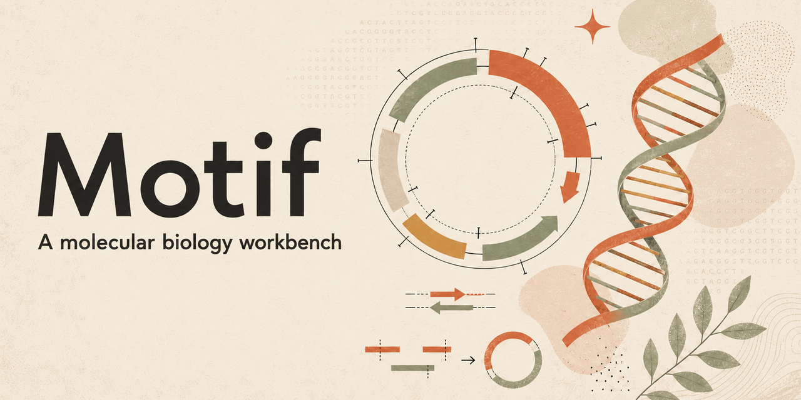
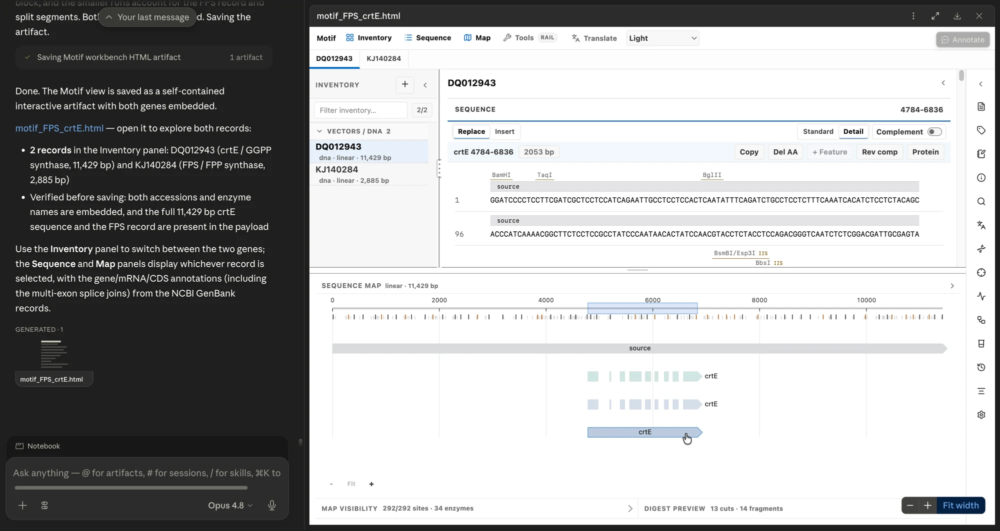

<p align="center">
  
</p>

# Motif

[Website](https://jvogan.github.io/motif-site/) ·
[Codex setup](docs/CODEX_QUICKSTART.md) ·
[Claude Science setup](docs/CLAUDE_SCIENCE_QUICKSTART.md) ·
[Capabilities](docs/CAPABILITIES.md) ·
[Examples](examples/README.md) ·
[Security](SECURITY.md)

Motif is an AI-native molecular-biology workbench for exploring, editing,
annotating, aligning, comparing, and sharing DNA, RNA, and protein records and
analysis results. Its core is a self-contained HTML workspace that can run on
its own or open through an AI host. The same Motif runtime supports sequence
records, maps, annotations, alignments, cloning workflows, Sanger traces,
provenance, checkpoints, and portable exports.

## Ways to use Motif

| Experience | Best for | Start here |
| --- | --- | --- |
| Portable HTML workbench | Local inspection, editing, and sharing without a host integration | [Develop from source](#develop-from-source) |
| Codex skills-only plugin | Creating portable workbenches directly from Codex | [Skills-only guide](docs/CODEX_SKILLS_ONLY.md) |
| Codex local plugin | Opening interactive workbenches through the local MCP App | [Local plugin quickstart](docs/CODEX_QUICKSTART.md) |
| Claude Science adapter | Opening Motif from a local Claude Science connector | [Claude Science quickstart](docs/CLAUDE_SCIENCE_QUICKSTART.md) |

The Codex local plugin and Claude Science adapter expose the same workbench
tools. `motif_open_workbench` opens the interactive MCP App, and
`motif_create_workbench_artifact` returns a portable HTML workbench. After
opening Motif, confirm that the expected records and active view are visible.

<p align="center">
  
</p>

<p align="center"><em>The Motif workbench opened through the Claude Science adapter. The same workbench is packaged for Codex and as portable HTML.</em></p>

This repository contains the host-neutral workbench, the Codex plugin, the
Claude Science adapter and plugin bundle, a standalone skill, and the local MCP
connector.

## What is included

- DNA, RNA, and protein records with annotations, tags, notes, and editing
  tools
- Standard and per-base Detail sequence views with selection and editing
- Circular and linear maps with features, coordinates, restriction sites,
  selection, labels, and pan/zoom
- Restriction digest prediction, fragment records, and a qualitative gel
- Primer/PCR design, Gibson, Golden Gate, GoldenBraid, and traditional ligation
  workflows
- In-browser MSA for 2–10 compatible records of up to 3,000 residues each,
  plus import and review of aligned FASTA/CLUSTAL
- An external MSA runner for MAFFT, MUSCLE, and Clustal Omega that invokes one
  selected executable without a command shell and records its version,
  arguments, and hashes
- AB1/ABI Sanger import and chromatogram review using existing base calls
- ORF and translation analysis, plus PAM-based CRISPR guide candidates
- Workflow history, typed analysis results, and inert plain-text or JSON
  attachments
- Database JSON checkpoint and restore, workspace ZIP export, and standard
  biological interchange formats
- Deterministic host packages with a full-workbench `ui://` App and portable
  HTML fallback

The [capability reference](docs/CAPABILITIES.md) distinguishes calculations
Motif performs from externally produced results it can store and display.

## Develop from source

Requires Git and Node.js 22.13 or newer on the 22.x line, or Node.js 24 or
newer. From a source checkout:

```bash
git clone https://github.com/jvogan/motif.git
cd motif
npm ci --ignore-scripts
npm run security:policy
npm run security:lifecycle
npm run preview:motif
```

Open `preview/motif-artifact.html`, or start an editable Vite session with:

```bash
npm run dev
```

The [public examples](examples/README.md) include synthetic FASTA, GenBank,
aligned CLUSTAL, and complete workspace JSON inputs with expected identities.

## Use with Codex

Motif has two Codex packages:

- The **skills-only plugin** bundles a local helper and a self-contained
  workbench resource. Codex can find, prepare, analyze, and transform data with
  its available tools, then create a portable Motif HTML workbench.
- The **full local plugin** adds Motif's typed MCP server and interactive App
  resource for opening the workbench inside Codex.

Build and verify the skills-only package with:

```bash
npm run test:codex-skills-plugin
```

See the [skills-only guide](docs/CODEX_SKILLS_ONLY.md) for installation and
verification. To stage the full local plugin:

```bash
npm run build:codex-marketplace
npm run codex:doctor:marketplace
```

Installation, verification, update, removal, and cache behavior for the full
local integration are documented in the
[Codex local plugin quickstart](docs/CODEX_QUICKSTART.md).

## Use with Claude Science

The Claude Science adapter uses the same workbench and two-tool connector.
Release installation, folder permissions, verification, rollback, and host
limitations are documented in the
[Claude Science quickstart](docs/CLAUDE_SCIENCE_QUICKSTART.md) and
[troubleshooting guide](docs/CLAUDE_SCIENCE_TROUBLESHOOTING.md).

Maintainers building from source can prepare and register the connector with:

```bash
npm run claude-science:setup
```

Setup preserves unrelated connector entries and writes a private backup before
changing the local Claude Science configuration.

## Build distributables

Build the canonical standalone and Claude-compatible artifacts with:

```bash
npm run build:motif
```

Build the additional Codex plugin or its local marketplace with:

```bash
npm run build:codex-plugin
npm run build:codex-marketplace
```

Build the separate skills-only Codex upload with:

```bash
npm run build:codex-skills-plugin
```

Generated packages are staged under `dist-motif/`; the local Codex marketplace
is staged under `.motif/codex-marketplace/`.

To generate a repo-local artifact with preloaded data:

```bash
npm run build:motif -- \
  --payload ./inventory.json \
  --out ./preview/my-motif-workspace.html
```

Use `--handoff /explicit/path/motif-artifact.html` only to write a copy outside
the repository. By default, the build writes nothing outside it.

## Validate

The canonical repository check is:

```bash
npm run gate
```

Codex packaging has focused checks:

```bash
npm run test:codex-plugin
npm run codex:doctor
npm run test:codex-skills-plugin
```

`npm run validate:plugin` adds strict Claude plugin validation when the Claude
CLI is installed. See [SUPPORT.md](SUPPORT.md) for host-specific diagnostic
commands.

## Compatibility identifiers

Some package paths, archive names, and plugin IDs still use
`motif-for-claude-science`. They are stable compatibility identifiers retained
for existing installations and release tooling; the product name shown to
people is **Motif**. New host-neutral contracts use `motif` or `MOTIF_` names.

## Data safety

Motif has no hosted backend. The standalone HTML and local connector do not
intentionally upload sequence data to a Motif service, and networking is off by
default. Data supplied to Codex, Claude Science, or another host remains
subject to that host's terms, privacy policy, organization settings, and data
controls. Do not use sensitive or unpublished sequences without authorization.
Workspace exports are ordinary unencrypted files; store and back them up
according to their sensitivity.

See [PRIVACY.md](PRIVACY.md), [SECURITY.md](SECURITY.md),
[SUPPORT.md](SUPPORT.md), [CHANGELOG.md](CHANGELOG.md), and
[THIRD_PARTY_NOTICES.md](THIRD_PARTY_NOTICES.md).

## License

MIT. Redistributed plugin bundles must retain `LICENSE`,
`THIRD_PARTY_NOTICES.md`, and record-level reference provenance.
